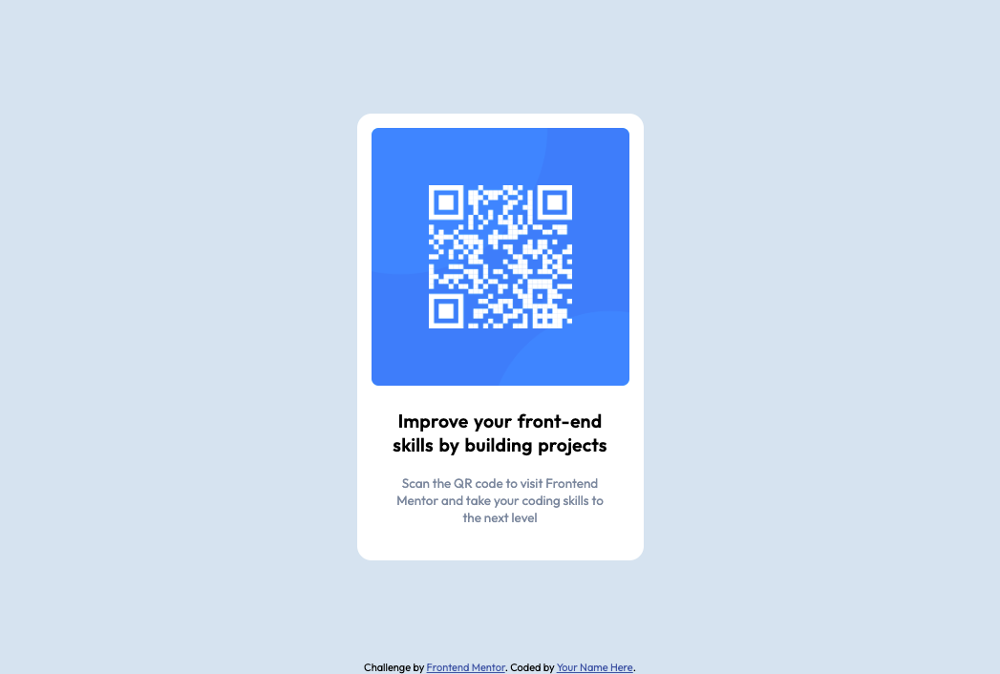

# Frontend Mentor - QR code component solution

This is a solution to the [QR code component challenge on Frontend Mentor](https://www.frontendmentor.io/challenges/qr-code-component-iux_sIO_H). Frontend Mentor challenges help you improve your coding skills by building realistic projects. 

## Table of contents

- [Frontend Mentor - QR code component solution](#frontend-mentor---qr-code-component-solution)
  - [Table of contents](#table-of-contents)
  - [Overview](#overview)
    - [Screenshot](#screenshot)
    - [Links](#links)
  - [My process](#my-process)
    - [Built with](#built-with)
    - [What I learned](#what-i-learned)
    - [Continued development](#continued-development)
  - [Author](#author)

## Overview

### Screenshot

### Links

- Solution URL: [https://www.frontendmentor.io/solutions/qr-code-component-with-vanilla-css-phTMUiK5FZ](https://www.frontendmentor.io/solutions/qr-code-component-with-vanilla-css-phTMUiK5FZ)
- Live Site URL: [https://master--cozy-meringue-6b754e.netlify.app/](https://master--cozy-meringue-6b754e.netlify.app/)

## My process

### Built with

- Vanilla HTML and CSS
- Vite for build/live-reload

### What I learned

This was my first Frontend Mentor challenge, so it was good to get familiarized with the process and workflow. I used Vite for building, which was an easy drop-in with just a few lines of code. For hosting, I went with Netlify, which was also really easy to set up - simply point to the github repo and tell Netlify how to build, and where to look for the build output.

In addition, I used this opportunity to get familiar with self-hosting fonts, which was also a pretty simple process, but worth getting to know. 

### Continued development

Some of my font sizes are off when comparing my submission on the Frontend Mentor website. I think this was because I used two different monitors to look at the design and my work, so I ended up adjusting the sizes to some magic-numbery rem values. Next time I'll be sure to compare on the same monitor before submitting.

## Author

- Website - [slimnate](https://slimnate.com)
- Frontend Mentor - [@slimnate](https://www.frontendmentor.io/profile/slimnate)
